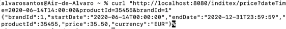

# Inditex Example

The following repo contains a test for Inditex.

## Overview

The objective of this test is to get Prices data from an API, based on Spring Boot, Java 11 and H2 database.
All data is loaded into the database when starting the application using Flyway. The load scripts can be found in the
path resources/db/migration.

#### Tecnologies

<ul>
<li>Java 11</li>
<li>Spring Boot</li>
<li>H2 Database</li>
</ul>

### How to launch the project

This guide is focused to launch the app through IntellijIDEA.
First, we need to clone it with this git command: ```git clone https://github.com/positiveRef/Inditex.git```. After this
step is completed,
we should click over ```File```, ```Open```, and then select the folder where you cloned the project.
Then right-click
over ```InditexApplication.java``` and
select ```Run```.
Or we can launch the app with the play button on the left of ```main()``` method in class editor.

### Sending a request to the API

Now we are able to send requests to the API. Currently, the only endpoint available is ```GET```
method ```/inditex/price```,
accepting as request parameters: ```dateTime``` (ISO date time format), ```productId``` (long) and ```brandId```(long).
Here is an example, using curl, of a valid request:
<br />
<br />


Here is the curl, if you want to just copy and paste in your terminal to replicate the example above: ```curl "http://localhost:8080/inditex/price?dateTime=2020-06-14T14:00:00&productId=35455&brandId=1"```
